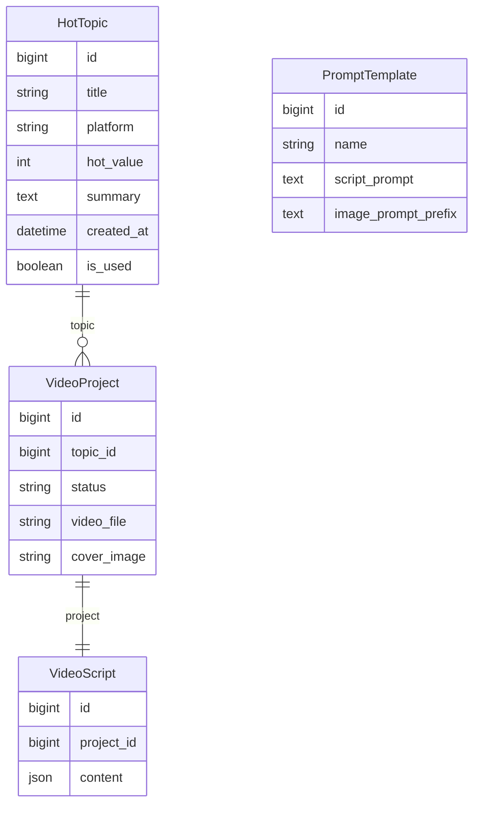
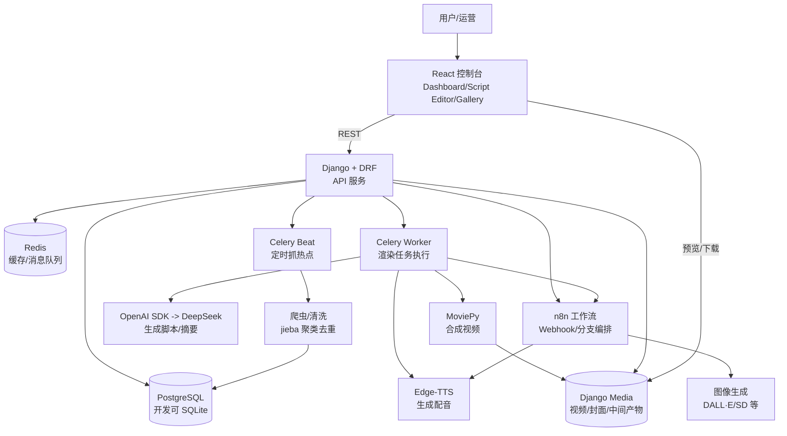

# 基于 React 的抖音热点短视频自动化生成系统（AutoVideo-Gen）

本文档用于论文/答辩材料中的以下章节：

- （4）技术堆栈（完成项目所需技术及开发工具）
- （5）核心业务逻辑说明
- （6）项目模块关系图
- （7）项目技术难点、项目业务难点

内容严格遵循 `project_specs.md` 的硬性约束：

- 后端：Django 4.2+、DRF、Celery、Redis
- 前端：React 18、Vite、TypeScript、TailwindCSS、Ant Design、React Query
- AI 工具：Edge-TTS、OpenAI SDK（调用 DeepSeek）、MoviePy（可配合 FFmpeg）
- 数据库：PostgreSQL（开发环境可用 SQLite 代替，但需保持兼容）
- 工程规范：Python Type Hints、关键函数 Docstrings、Django apps 分离（`core`/`video`）

---

# （4）技术堆栈（完成项目所需技术及开发工具）

## 4.1 总体架构与设计思想

本系统属于“内容生产型”应用，核心计算（文案生成、配音、素材准备、视频渲染）均为耗时任务，因此采用：

- **前后端分离**：React 控制台负责交互与配置；Django/DRF 提供 REST API。
- **异步任务驱动**：视频渲染由 Celery Worker 执行，Redis 负责消息队列与缓存，避免接口阻塞。
- **人在回路（Human-in-the-loop）**：脚本生成后进入人工编辑确认环节，提高正确性与可控性。
- **模板化与可扩展**：PromptTemplate 抽象“文案风格/绘图提示词前缀”，渲染逻辑与模板参数解耦。

## 4.2 后端技术栈（数据中心 + 渲染中心）

- **语言/运行环境**：Python 3.9+
- **Web 框架**：Django 4.2+
- **接口层**：Django REST Framework（DRF）
  - 统一序列化与校验
  - 统一异常处理与响应结构
  - 视图层承载业务编排入口
- **异步任务**：Celery
  - 渲染任务：`task_render_video(project_id)`
  - 定时任务：Celery Beat 定时抓取热点 `fetch_hot_topics`
- **缓存/消息队列**：Redis
  - Celery Broker/Backend
  - 热点榜单缓存（可选）
  - 生成任务状态/进度缓存（可选）
- **数据库**：PostgreSQL
  - 开发阶段可用 SQLite，但模型设计与查询需保持可迁移性

## 4.3 AI 与多媒体处理栈

- **LLM 文案生成**：OpenAI SDK（用于调用 DeepSeek）
  - 用途：脚本/分镜 JSON 生成、热点摘要 `summary` 生成
  - 方式：后端直接调用或经 n8n 编排调用
- **配音（TTS）**：Edge-TTS（Python 库，强制使用）
  - 用途：将分镜台词转为 mp3，并用于估算分镜时长
- **视频合成**：MoviePy（核心）
  - 图片 + 音频对齐
  - 过渡/缩放（Zoom-in）增强动态感
  - 字幕：可选使用 `TextClip` 烧录，或生成 SRT/ASS 后再处理
- **FFmpeg（可选配合）**
  - 用于转码、音频混音、容器封装等底层处理（在 MoviePy 能力不足时补齐）

## 4.4 前端技术栈（React 控制台）

- **框架**：React 18
- **构建工具**：Vite
- **语言**：TypeScript
- **样式**：TailwindCSS
- **组件库**：Ant Design
- **数据请求与缓存**：React Query
- **工程规范**：Functional Components + Hooks

前端建议的核心页面与功能：

- **Dashboard（热点看板）**：微博/知乎等平台热榜浏览、筛选、选择并发起生成
- **Script Editor（脚本工坊）**：分镜卡片式编辑（台词/提示词/素材预览/重绘/试听）
- **Gallery（视频库）**：生成结果预览、下载、查看生成耗时与使用的模板/Prompt

## 4.5 工作流与自动化（n8n）

- **n8n（Docker 部署）**：用于“AI 资源调度链”（可选，但作为架构亮点建议保留）
  - Webhook 接收 Django 请求
  - 分支执行：
    - 图像生成（OpenAI DALL·E / Stable Diffusion API 等）
    - 音频生成（Edge-TTS 服务化调用）
  - 将资源 URL 返回给 Django

## 4.6 开发工具与环境

- **开发工具**：VS Code / PyCharm、Chrome DevTools
- **接口调试**：Postman / Apifox
- **数据库工具**：pgAdmin / DBeaver
- **Redis 工具**：RedisInsight
- **版本管理**：Git（GitHub/Gitee）
- **容器化（推荐）**：Docker Desktop（用于 n8n、Redis、PostgreSQL 一键部署）

---

# （5）核心业务逻辑说明

本系统的业务目标是：从热点舆情中自动构建短视频生产素材链路，并在人在回路机制下输出可用的成品短视频。

## 5.1 业务实体（结合数据模型）

### 5.1.1 `core` 应用（基础数据）

- **HotTopic（热点话题）**
  - 字段：`title`、`platform`、`hot_value`、`summary`、`created_at`、`is_used`
  - 作用：承载热点源数据，是生成视频项目的输入。

- **PromptTemplate（提示词模板）**
  - 字段：`name`、`script_prompt`、`image_prompt_prefix`
  - 作用：抽象视频风格与生成提示词，使“风格”可配置、可复用。

### 5.1.2 `video` 应用（视频业务）

- **VideoProject（视频项目）**
  - 关联：`topic -> HotTopic`
  - 状态：`DRAFT`、`WAIT_CONFIRM`、`RENDERING`、`COMPLETED`、`FAILED`
  - 产物：`video_file`、`cover_image`

- **VideoScript（分镜脚本）**
  - 字段：`content`（JSON 列表）
  - 每个分镜建议包含：
    - `order`：序号
    - `text`：旁白台词
    - `image_prompt`：画面提示词
    - `image_path`：图像本地路径或 URL
    - `audio_path`：音频本地路径
    - `duration`：分镜时长（秒）

### 5.1.3 数据库 ER 图（Mermaid）



`PromptTemplate` 作为“风格/提示词模板表”由 `generate_script` 接口按 `template_id` 读取使用；若需要在数据库中追溯“某成品使用了哪个模板”，可在 `VideoProject` 或 `VideoScript` 增加 `template` 外键字段。

## 5.2 核心业务流程（端到端）

### 5.2.0 业务流程图（Mermaid）

```mermaid
flowchart TD
  %% 定时热点采集
  BEAT[Celery Beat 定时任务\nfetch_hot_topics] --> CRAWLER[爬虫抓取 + 清洗\njieba 聚类去重]
  CRAWLER --> HT[(HotTopic 入库/更新)]

  %% 控制台发起
  U[用户/运营] --> FE[React 控制台\nDashboard]
  FE -->|选择热点+模板| API1[POST /api/video/generate_script]
  API1 --> LLM[DeepSeek\n(OpenAI SDK)]
  LLM --> VS[(VideoScript.content 保存)]
  VS --> VP1[(VideoProject.status = WAIT_CONFIRM)]

  %% 人在回路
  FE --> EDIT[Script Editor\n分镜编辑/重绘/试听]
  EDIT -->|确认渲染| API2[POST /api/video/confirm_render]
  API2 --> VP2[(VideoProject.status = RENDERING)]
  API2 --> Q[Redis 队列\n投递 task_render_video]

  %% 异步渲染
  Q --> WORKER[Celery Worker\ntask_render_video(project_id)]
  WORKER --> ASSET{素材是否齐全?}
  ASSET -->|缺图/缺音| N8N[n8n Webhook\n资源调度链]
  N8N --> IMG[图片生成/获取\nURL->落盘]
  N8N --> TTS[Edge-TTS\n台词->mp3]
  ASSET -->|已齐全| RENDER[MoviePy 合成\n图片+音频对齐+拼接]
  IMG --> RENDER
  TTS --> RENDER
  RENDER --> MEDIA[(Django Media\nmp4/封面/中间产物)]
  MEDIA --> VP3[(VideoProject.status = COMPLETED)]
  WORKER -->|异常| VP4[(VideoProject.status = FAILED\n记录失败原因)]

  %% 成品展示
  FE --> GALLERY[Gallery 视频库\n预览/下载/元数据]
  GALLERY --> MEDIA
```

### 5.2.1 热点采集与入库（定时任务）

- **触发方式**：Celery Beat 每 2 小时执行一次 `fetch_hot_topics`
- **数据来源**：微博热搜、知乎热榜等（可扩展更多平台）
- **关键处理**：
  - 抓取 -> 清洗 -> 关键词聚类（`jieba`）-> 去重入库
  - 若标题已存在：更新热度 `hot_value`
  - 若不存在：创建新 HotTopic，并生成/更新摘要 `summary`（可由 LLM 生成）

### 5.2.2 脚本生成（API：生成分镜 JSON）

- **API**：`POST /api/video/generate_script/`
- **输入**：`topic_id`、`template_id`
- **业务逻辑**：
  1. 校验热点与模板存在性
  2. 使用模板 `script_prompt` + 热点内容组合 Prompt
  3. 调用 DeepSeek（经 OpenAI SDK）生成分镜脚本 JSON
  4. 将 JSON 存入 `VideoScript.content`
  5. 更新 `VideoProject.status = WAIT_CONFIRM`

该阶段产物是“可编辑脚本”，不直接进入渲染，体现人在回路。

### 5.2.3 人工编辑确认（前端 Script Editor）

- 用户可以对每个分镜执行：
  - 修改台词 `text`
  - 调整画面提示词 `image_prompt`
  - 重新生成图片（重绘）
  - 试听配音（TTS）

编辑后的脚本回写后端，确保渲染输入可控。

### 5.2.4 确认渲染（API：触发异步渲染任务）

- **API**：`POST /api/video/confirm_render/`
- **业务逻辑**：
  1. 校验项目状态为 `WAIT_CONFIRM`
  2. 更新 `VideoProject.status = RENDERING`
  3. 投递 Celery 任务 `task_render_video(project_id)`

### 5.2.5 视频渲染引擎（Celery：耗时任务）

- **Celery 任务**：`task_render_video(project_id)`
- **主要步骤**：
  1. 读取 `VideoScript.content`，遍历分镜列表
  2. **资源准备**（分镜级）：
     - 若缺图：通过 n8n Webhook 或直接调绘图 API 获取图像资源并落盘
     - 若缺音：使用 Edge-TTS 根据 `text` 生成 mp3 并落盘
     - 计算 `duration`：依据音频时长（优先）或估算策略
  3. **合成**（MoviePy）：
     - 图片 clip 的时长与音频对齐（`set_duration`）
     - 加入轻微缩放/平移效果增强动态感
     - 字幕：可选 `TextClip` 烧录；或生成 SRT 再处理
     - `concatenate_videoclips` 拼接生成最终 mp4
  4. 输出产物：保存 `video_file`、生成/截取 `cover_image`
  5. 更新状态：成功 `COMPLETED`；异常捕获并记录原因后置为 `FAILED`

## 5.3 状态机与幂等性说明

- 状态机用于限制操作：
  - `DRAFT -> WAIT_CONFIRM -> RENDERING -> COMPLETED/FAILED`
- 关键约束：
  - `confirm_render` 仅允许在 `WAIT_CONFIRM` 状态触发
  - 渲染任务应避免重复提交（建议设置幂等键，如同一 project_id 同时只允许一个渲染任务运行）

---

# （6）项目模块关系图

## 6.1 系统架构模块图（Mermaid）



## 6.2 模块职责说明

- **React 控制台**：热点浏览与选择、模板选择、脚本编辑（人在回路）、任务状态查看、视频预览与下载。
- **Django/DRF API 服务**：业务编排入口（生成脚本、确认渲染、项目/脚本 CRUD）、权限校验、统一错误处理。
- **core app**：热点数据与模板管理（HotTopic、PromptTemplate）、爬虫与清洗逻辑。
- **video app**：项目与脚本数据（VideoProject、VideoScript）、渲染任务入口与结果管理。
- **Celery Worker**：承载耗时的视频生成链路，保证接口快速响应与系统稳定。
- **Redis**：Celery 消息队列/结果后端与缓存。
- **n8n（可选）**：多模态资源（图片/音频）生成的流程编排器，使外部 AI 能力可替换、可扩展。
- **MoviePy/Edge-TTS/OpenAI SDK**：实现“文案->配音->合成”的核心算法与工程链路。

---

# （7）项目技术难点、项目业务难点

## 7.1 项目技术难点

### 7.1.1 耗时任务的异步化与可观测性
- **难点**：视频渲染链路包含下载/生成素材、TTS、转码与拼接，执行时间长且易受外部接口波动影响。
- **解决思路**：
  - Celery 将渲染从请求线程剥离
  - 使用状态机（`WAIT_CONFIRM/RENDERING/COMPLETED/FAILED`）保障可控
  - 对任务进行分阶段日志记录（分镜级日志更便于定位）

### 7.1.2 分镜时长与音画对齐（字幕/台词对齐）
- **难点**：TTS 语速、文本标点与分句策略影响时长，容易导致字幕与画面节奏不一致。
- **解决思路**：
  - 以音频实际时长作为分镜 duration 的权威来源
  - 文本分句：基于标点 + 最大字数阈值切分，避免超长句
  - 字幕方案分层：
    - 优先：生成 SRT（易实现、稳定）
    - 进阶：TextClip/ASS 字幕样式（可作为论文“进一步工作”）

### 7.1.3 资源获取链路的稳定性（重试、降级、幂等）
- **难点**：外部 AI 服务（LLM/绘图）失败率与延迟不可控；重复触发渲染会浪费算力。
- **解决思路**：
  - 资源阶段落盘与缓存：已有 image/audio 不重复生成
  - 对外部调用设置超时、重试上限与错误分类
  - 任务幂等：同一 `project_id` 同时仅允许一个渲染任务

### 7.1.4 热点数据去重与质量控制
- **难点**：不同平台同一事件存在标题差异；直接入库会造成重复生产。
- **解决思路**：
  - `jieba` 分词 + 简单聚类/相似度策略（MVP 可先做关键词重叠去重）
  - 结合平台、发布时间、关键词指纹构建去重键

### 7.1.5 大文件管理与部署环境一致性
- **难点**：视频文件体积大；不同环境中 ffmpeg/字体/编码可能导致渲染结果不一致。
- **解决思路**：
  - 统一 Media 目录规范、清理策略与命名规范
  - Docker 化关键依赖（Redis/PostgreSQL/n8n），保证环境一致
  - 对字体与渲染参数进行固定配置，减少“换机不可复现”问题

## 7.2 项目业务难点

### 7.2.1 内容合规与平台规则约束
- **难点**：热点内容可能涉及敏感话题、谣言与误导性表达；“自动发布”存在平台规则与账号风险。
- **解决思路**：
  - 引入人在回路：脚本生成后必须人工确认再渲染
  - 在文案生成 Prompt 中加入合规约束（不造谣、不做医疗/金融建议等）
  - 论文中建议定位为“生成与导出”，发布作为可选扩展（更稳妥）

### 7.2.2 可控性与风格一致性
- **难点**：不同热点需要不同叙事风格，且同一账号需保持一致风格。
- **解决思路**：
  - PromptTemplate 抽象风格模板（新闻播报/悬疑解说等）
  - 脚本编辑器允许人工微调关键词、结构与语气

### 7.2.3 质量评估与可量化成果展示
- **难点**：毕设需要清晰呈现效果与创新点，仅“能生成视频”说服力不足。
- **建议指标**：
  - 单条视频平均生成耗时、成功率、失败原因分布
  - 模板复用次数、人为修改占比（体现“人在回路”价值）
  - 生成视频长度分布、分镜数量分布

---

# 附：可直接用于论文的“创新点概括”（来自 specs 的落地表述）

1. **Human-in-the-loop（人在回路）**：通过“脚本工坊”提供可视化分镜编辑与试听/重绘能力，避免全自动黑盒生成导致的错误传播。
2. **动态工作流编排**：Prompt 模板与渲染逻辑分离，引入 n8n 作为可插拔的多模态资源调度层，便于替换/扩展外部 AI 能力。
3. **自动化数据管道**：使用 Celery Beat 实现热点舆情的定时采集、清洗与入库，完成从“舆情发现”到“内容生产”的链路自动化。
