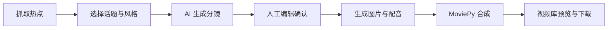

<div align="center">

# AutoVideo-Gen

**热点发现 → AI 分镜 → 人工校对 → 自动配音与成片**

一个面向短视频内容生产的全栈原型。系统从微博、知乎和抖音热点出发，生成可编辑的分镜脚本，并通过图像生成、Edge TTS 与 MoviePy 输出视频。

</div>

## 项目亮点

- **热点聚合**：抓取微博、知乎、抖音热榜，按平台查看并选择创作主题。
- **AI 分镜**：通过 OpenAI 兼容接口调用 DeepSeek，生成约 5 段结构化分镜；未配置模型时可使用本地 Mock 脚本跑通流程。
- **人在回路**：生成后先进入脚本编辑器，可修改旁白、画面提示词和预估时长，再确认渲染。
- **自动化成片**：使用 SiliconFlow FLUX 生成画面、Edge TTS 生成中文配音、MoviePy 完成音画对齐与 MP4 合成。
- **作品管理**：视频库统一展示项目状态，支持再次编辑脚本和下载成片。
- **可用性降级**：热点接口、LLM 或图像服务不可用时提供 Mock、占位图等降级路径，便于本地演示。

## 工作流程



## 技术栈

| 层级 | 技术 |
| --- | --- |
| 前端 | React 18、TypeScript、Vite、Ant Design、Tailwind CSS、TanStack Query |
| 后端 | Django、Django REST Framework、SQLite |
| AI | OpenAI Python SDK、DeepSeek / SiliconFlow、FLUX.1-schnell |
| 多媒体 | Edge TTS、MoviePy、Pillow、FFmpeg |
| 数据采集 | Requests |

## 项目结构

```text
.
├── backend/
│   ├── backend/              # Django 配置与路由
│   ├── core/                 # 热点模型、采集器、AI 脚本服务
│   ├── video/                # 视频项目、分镜、渲染引擎
│   └── manage.py
├── frontend/
│   ├── src/
│   │   ├── pages/            # Dashboard / Editor / Gallery
│   │   ├── layouts/
│   │   ├── services/         # API 请求封装
│   │   └── types.ts
│   └── package.json
├── .env.example
├── requirements.txt
└── project_specs.md
```

## 本地运行

### 1. 环境要求

- Python 3.12+
- Node.js 20+
- FFmpeg（MoviePy 输出 MP4 时需要）
- npm

### 2. 克隆项目

```bash
git clone https://github.com/q1zero/ai-.git
cd ai-
```

### 3. 启动后端

Windows PowerShell：

```powershell
py -3.12 -m venv .venv
.\.venv\Scripts\Activate.ps1
pip install -r requirements.txt
Copy-Item .env.example .env
python backend/manage.py migrate
python backend/manage.py runserver 127.0.0.1:8000
```

macOS / Linux：

```bash
python3 -m venv .venv
source .venv/bin/activate
pip install -r requirements.txt
cp .env.example .env
python backend/manage.py migrate
python backend/manage.py runserver 127.0.0.1:8000
```

后端默认运行在 `http://127.0.0.1:8000`。

### 4. 启动前端

另开一个终端：

```bash
cd frontend
npm install
npm run dev
```

访问 `http://127.0.0.1:5173`。Vite 已配置 `/api` 与 `/media` 代理，无需额外修改请求地址。

## 环境变量

复制 `.env.example` 为 `.env` 后按需填写：

| 变量 | 是否必填 | 说明 |
| --- | --- | --- |
| `LLM_API_KEY` | 否 | SiliconFlow API Key；为空时脚本与图片生成会走降级逻辑 |
| `LLM_BASE_URL` | 否 | OpenAI 兼容接口地址，默认 `https://api.siliconflow.cn/v1` |
| `LLM_MODEL` | 否 | 文本模型名称，默认 `deepseek-chat` |
| `DJANGO_SECRET_KEY` | 否 | 预留的 Django 密钥配置 |
| `DJANGO_DEBUG` | 否 | 预留的 Django 调试开关 |

请勿提交包含真实密钥的 `.env` 文件。

## 主要接口

| 方法 | 路径 | 作用 |
| --- | --- | --- |
| `GET` | `/api/core/hot-topics/` | 获取热点列表 |
| `POST` | `/api/core/crawl-hot-topics/` | 触发热点抓取 |
| `POST` | `/api/video/preview_script/` | 生成脚本预览 |
| `POST` | `/api/video/generate_script/` | 创建项目并保存脚本 |
| `POST` | `/api/video/start_render/` | 保存编辑结果并生成视频 |
| `GET` | `/api/video/projects/` | 获取视频项目列表 |
| `GET` | `/api/video/scripts/{id}/` | 获取指定分镜脚本 |

## 当前状态

项目目前是可运行的 MVP。视频渲染在 Django 请求中同步执行，单次生成通常需要等待一段时间；热点源接口失败时会返回演示数据。后续适合将渲染任务迁移到 Celery / Redis，并补充任务进度、失败重试、对象存储和自动化测试。

## 开发命令

```bash
# 前端代码检查
cd frontend
npm run lint

# 前端生产构建
npm run build

# Django 基础检查
cd ..
python backend/manage.py check
```
